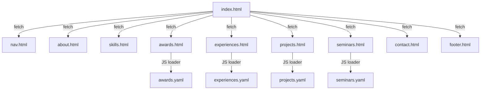

# KimTeddy.github.io 포트폴리오 사이트 구조 분석

## 📌 사이트 개요

| 항목 | 내용 |
|------|------|
| **URL** | `https://kimteddy.github.io/` |
| **용도** | 임베디드 시스템 엔지니어 포트폴리오 |
| **소유자** | Teddy Kim (KimTeddy) |
| **타이틀** | TeddyElectronics - 테디의 전자공학 |
| **호스팅** | GitHub Pages (정적 사이트) |
| **빌드 도구** | 없음 (순수 HTML/CSS/JS) |

---

## 🏗️ 아키텍처

**싱글 페이지 앱(SPA) 방식** — `index.html`이 메인 진입점이며, 각 섹션 HTML을 `fetch()`로 동적 로드합니다.



---

## 📁 파일 구조

```
KimTeddy.github.io/
├── index.html              # 메인 페이지 (44KB, 789줄) — 모든 섹션을 fetch()로 통합
├── nav.html                # 네비게이션 바 (고정, 블러 배경, 스크롤 프로그레스 바)
├── header.html             # 헤더 (로고, 진입 애니메이션) — 현재 index에서 미포함
├── about.html              # About 섹션 (자기소개 + 코딩 타이핑 애니메이션)
├── skills.html             # Skills 섹션 (프로그래밍, CAD, 전자회로 카드 3개)
├── awards.html             # Awards 섹션 (YAML → 동적 렌더링)
├── experiences.html        # Experiences 섹션 (YAML → 동적 렌더링)
├── projects.html           # Projects 섹션 (가로 스크롤, YAML → 동적 렌더링)
├── seminars.html           # Seminars 섹션 (YAML → 동적 렌더링)
├── contact.html            # Contact 섹션 (GitHub, Instagram, Email)
├── footer.html             # Footer (프로필, 소셜 링크, 저작권)
├── README.md               # 리포지토리 설명
│
└── assets/
    ├── css/
    │   └── styles.css      # 메인 스타일시트 (11.5KB, 529줄)
    │
    ├── js/
    │   ├── about-animation.js     # About 애니메이션 (현재 미사용)
    │   ├── filter_projects.js     # 프로젝트 필터링
    │   ├── load_awards.js         # YAML → Awards 카드 렌더링
    │   ├── load_experiences.js    # YAML → Experiences 카드 렌더링
    │   ├── load_projects.js       # YAML → Projects 카드 렌더링
    │   └── load_seminars.js       # YAML → Seminars 카드 렌더링
    │
    ├── data/
    │   ├── awards.yaml       # 수상 내역 (2019~2024)
    │   ├── experiences.yaml  # 경험 내역 (2019~2025)
    │   ├── projects.yaml     # 프로젝트 (7개 카테고리, 20+ 프로젝트)
    │   └── seminars.yaml     # 세미나 (15+ 세미나)
    │
    └── images/
        ├── logos/            # GitHub, Instagram, YouTube, Naver 등 아이콘
        ├── sections/
        │   ├── projects/     # 프로젝트 이미지 (연도별 하위 폴더)
        │   ├── seminars/     # 세미나 이미지 (연도별 하위 폴더)
        │   └── skills/       # 스킬 카드 이미지
        └── site/
            ├── TeddyElectronics.ico       # 파비콘
            └── profile-custom-rainbow.svg # 프로필 SVG
```

---

## 🎨 디자인 시스템

### 색상 팔레트
| 용도 | Light Mode | Dark Mode |
|------|-----------|-----------|
| **배경(body)** | `#121212` | `#000000` |
| **섹션 배경** | `#dfdfdf` | `#212121` |
| **카드 배경** | `#fff` | `#161616` |
| **사이드바** | `#1f1f1f` | — |
| **메인 영역** | `#1f1f1f` | — |
| **악센트(제목)** | `#1e88e5` | `#90caf9` |
| **악센트(강조)** | `#00ffbb` / `#00ffe5` | `#81d4fa` |
| **섹션 하단선** | `#64b5f6` | — |

### 폰트
- **기본**: `'Roboto', Arial, sans-serif` (Google Fonts CDN)
- **코딩 애니메이션**: `'Courier New', Courier, monospace`

### 레이아웃
- **상단**: 사이드바(프로필+기술스택) + 메인 영역(소개+서비스)을 flexbox로 나란히 배치
- **하단**: 각 섹션이 `<section>` 태그로 순서대로 나열
- **반응형 브레이크포인트**: 950px, 768px, 650px, 500px, 455px

---

## 🔧 핵심 기능

### 1. 동적 콘텐츠 로딩
- 모든 섹션 HTML은 `fetch()`로 비동기 로드 → `innerHTML`에 삽입
- Awards, Experiences, Projects, Seminars는 **YAML 파일**에서 데이터를 로드
- YAML 파싱은 `js-yaml` 라이브러리 (CDN: `cdnjs.cloudflare.com`)
- 로드 실패 시 **최대 3회 재시도** 로직 포함

### 2. 다크 모드
- 시스템 설정 감지: `prefers-color-scheme: dark`
- 수동 토글: `#dark-mode-toggle` 버튼 (🌙)
- `body.dark-mode` 클래스로 전환, CSS 트랜지션 적용

### 3. 타이핑 애니메이션 (About 섹션)
- C, Python, Java, HTML 등 여러 언어로 자기소개 문장을 타이핑
- 타이핑 → 대기 → 삭제 → 다음 문장 반복
- VS Code 스타일의 코드 에디터 UI

### 4. 프로젝트 가로 스크롤
- 카테고리별(팀_전공, 동아리, OpenGL, OpenCV, IoT, Verilog, 아두이노 등) 가로 스크롤
- 호버 시 3D 변환 효과 (`rotateX(15deg)`, `translateZ(10px)`)
- 이미지 호버 시 확대 (`scale(1.5)`)

### 5. UI 요소
- **스크롤 프로그레스 바**: 상단 고정, 스크롤 진행률 표시
- **Back-to-top 버튼**: 300px 이상 스크롤 시 노출, 바운스 애니메이션
- **서비스 카드 토글**: `toggleService()` — 클릭 시 확장/축소
- **섹션 호버 확장**: `section:hover { max-width: 100% }` (90% → 100%)

---

## 📊 콘텐츠 요약

### 프로필 (Teddy Kim)
- **직함**: Embedded System Developer
- **통계**: 10+ years experience, 20+ projects, 7+ awards, 10+ seminars
- **소셜**: GitHub, Naver Blog, YouTube, Instagram, Email

### 기술 스택
| 분류 | 기술 |
|------|------|
| **언어** | C, C++, Verilog, HTML/CSS/JS, Markdown, VBScript, Batch |
| **하드웨어** | STM32(ARM), ATmega, FPGA, Arduino, Raspberry Pi |
| **IDE** | IAR, STM32CubeIDE/MX, Vivado, Vitis, VS, VSCode |
| **CAD** | KiCad(PCB), SOLIDWORKS(3D) |
| **IoT** | Home Assistant, ESPHome, Node-RED, YAML |
| **라이브러리** | OpenGL, OpenCV |

### 프로젝트 카테고리 (projects.yaml)
1. **팀_전공**: A.RM.I(졸업작품), NOsquito, 운전면허 시뮬레이션, Mini Curling
2. **대학교 동아리**: JokBal(웨어러블 로봇), LineTracer, BallancingBot
3. **OpenGL**: PONG, 2D/3D Car Escape, 운전면허 시뮬레이션
4. **OpenCV**: 동영상/이미지 영상처리, Video to BMP
5. **IoT**: Home IoT 조명, IoT LED PCB, 거실 라이트쇼
6. **Verilog**: AXI, CLA, UART, Digital Watch
7. **아두이노/others**: Laser Harp, IoT 전등스위치, 버스 알림, 업사이클 조명

### 수상 내역 (awards.yaml)
- **2024**: 캡스톤 은상, 임베디드SW경진대회 입선, 한이음 입선, UCC 동상
- **2023**: ICT멘토링 학술대회 최우수상, 캡스톤 은상, CDE DX Awards 장려상
- **2022**: 캡스톤 대상
- **2019**: 라인트레이서 대회 1등

### 세미나 (seminars.yaml)
- 15+ 세미나 주최/진행 (2022~2025)
- 최대 참석자: 59명 (동아리 OT)
- 주제: C, Arduino, ATmega, Linux, PCB설계, MCU, SOLIDWORKS, GitHub 등

---

## ⚠️ 참고사항

- `header.html`은 존재하지만 `index.html`에서 포함되지 않음 (미사용)
- `about-animation.js`는 주석 처리되어 미사용
- `filter_projects.js`는 존재하지만 `index.html`에서 로드되지 않음
- 이전 대화에서 모바일 UI 수정(awards 레이아웃) 및 3D 배경 모델 관련 작업 이력이 있음
- 사이트 언어: 한국어/영어 혼용
